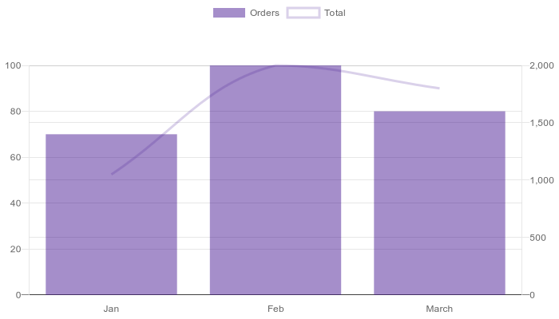

# Chart Generator

<p align="center">
<a href="https://packagist.org/packages/square1/chart-generator"></a>
<a href="https://packagist.org/packages/square1/chart-generator"></a>
<a href="https://packagist.org/packages/square1/chart-generator"></a>
</p>

## Install

Via composer

```shell
$ composer require square1/chart-generator
```

From Laravel 5.5 uses Package Auto-Discovery, so doesn't require you to manually add the ServiceProvider and Facade.

If you don't use auto-discovery, add the ServiceProvider to the `providers` array in **config/app.php**

```php
    'providers' => [
        // ...
        Square1\ChartGenerator\ServiceProvider::class
    ]
```

And add the alias into `aliases`

```php
    'aliases' => [
        // ...
        'ChartGenerator' => Square1\ChartGenerator\Facade::class
    ]
```

## Configuration

By default, the package uses the following environment variables to auto-configure the plugin without modification:

```dotenv
CHART_SERVICE_URL=
CHART_SERVICE_KEY=
CHART_SERVICE_SECRET=
```

## Usage

Generate a 700x400 bar chart as [Intervention image](http://image.intervention.io/use/basics).

```php
/** @var \Intervention\Image\Image $image */
$image = ChartGenerator::createChart('bar', 700, 400, ['Jan' => 100, 'Feb' => 100, 'March' => 100], [/* See options section */]);
```

### Options

Chart.js allows some options to configure and personalize the chart. This is the current list of features available:

| Option | Type | Default | Description |
|:------ |:---- |:------- |:----------- |
| title | string or false | false | Show a title on the middle of chart or not |
| padding | array | ['top' => 0, 'left' => 0, 'right' => 0, 'bottom' => 0] | Add padding to the chart |
| showValues | string | 'center' | Show the values on the chart |
| showDifference | bool | false' | Show the difference between the two first datasets on the chart |
| beginAtZero | bool | false | If true, scale will include 0 if it is not already included |
| stepSize | int | - | User defined fixed step size for the scale |
| maxTicksLimit | int | - | User defined fixed max steps for the scale |
| hideScales | bool | false | Hide the scale for axis Y |
| wrapLabel | bool | false | Wrap the label text by spaces |
| labelSize | bool | 12 | Change the size of the label |
| labelColor | bool | '#666' | Change the color of the label |
| legend | bool | true | Show the legend on the chart |
| legendPosition | string | 'top' | Allow select the position to show the legend |
| showGridLinesX | bool | false | Show the grid for the axis X |
| showGridLinesY | bool | false | Show the grid for the axis Y |
| emptyLines | bool | false | Only on **line** chart. Show only the line, removing the background color |
| hidePoints | bool | false | Only on **line** chart. Hide the points to show only the line |
| smallWidth | bool | false | Only on **bar** chart. Reduces the width to 50% |
| barThickness | int | 'flex' | Only on **bar** chart. Set the thickness of the bars |
| format | string | - | Allow format the values. Currently the options available are: `money`, `label` |
| currency | string | - | Currency used if the format is `money` |
| color | string or array | rgba(0, 0, 0, 0.1) | Background color for the chart. It's possible define an array with different colors and patterns. See on examples |
| position | string | 'left' | Only on **mixed** chart. Select where the axis Y should be shown |

## Examples

* 700x400 bar chart

```php
/** @var \Intervention\Image\Image $image */
$image = ChartGenerator::createChart('bar', 700, 400, ['Jan' => 100, 'Feb' => 100, 'March' => 100], []);
```


* 700x400 bar chart with a pattern

```php
/** @var \Intervention\Image\Image $image */
$image = ChartGenerator::createChart('bar', 700, 400, ['Jan' => 100, 'Feb' => 100, 'March' => 100], ['color' => ['pattern' => 'line', 'color' => 'rgba(74, 29, 150, 0.7)']]);
```


* 700x400 bar chart with multiple dataset and pattern

```php
/** @var \Intervention\Image\Image $image */
$image = ChartGenerator::createChart('bar', 700, 400, ['Jan' => [100, 120], 'Feb' => [130, 50]], ['beginAtZero' => true, 'color' => [['pattern' => 'triangle', 'color' => 'rgba(74, 29, 150, 0.5)'], ['pattern' => 'line', 'color' => 'rgba(74, 29, 150, 0.7)']]]);
```


* 700x400 mixed chart

```php
/** @var \Intervention\Image\Image $image */
$image = ChartGenerator::createMixedChart('', 700, 400, [
    [
        'data' => ['Jan' => ['Orders' => 70], 'Feb' => ['Orders' => 100], 'March' => ['Orders' => 80]],
        'options' => ['type' => 'bar', 'beginAtZero' => true,  'showGridLinesY' => true, 'maxTicksLimit' => 7, 'format' => 'money', 'position' => 'left', 'color' => 'rgba(74, 29, 150, 0.5)'],
    ],
    [
        'data' => ['Jan' => ['Total' => 1050], 'Feb' => ['Total' => 2000], 'March' => ['Total' => 1800]],
        'options' => ['type' => 'line', 'emptyLines' => true,'beginAtZero' => true, 'showGridLinesY' => true, 'hidePoints' => true, 'maxTicksLimit' => 7,  'format' => 'money', 'position' => 'right', 'color' => 'rgba(74, 29, 150, 0.2)']
    ]
]);
```


